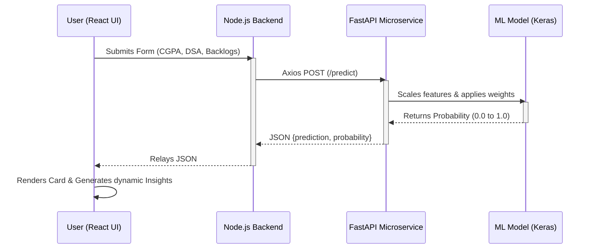

# MMSpace AI Placement Predictor - Architecture & Implementation Guide

This document provides a comprehensive overview of the **AI Placement Predictor** feature integrated into the **MMSpace** application. It explains the technology stack, the data pipeline, the Artificial Neural Network (ANN) model, the microservice architecture, and how the frontend interacts with the backend to deliver seamless predictions.

---

## 1. Technology Stack Overview

To handle the distinct requirements of a modern web application and a machine learning pipeline, we adopted a **Polyglot Microservice Architecture**:

*   **Frontend (UI Level):** React.js, Tailwind CSS, Lucide React (Icons)
*   **Main Backend (API Gateway):** Node.js, Express.js
*   **Machine Learning Microservice:** Python 3, FastAPI, Uvicorn
*   **Data Science Core:** TensorFlow/Keras (ANN), Scikit-Learn (Scaling/Metrics), Pandas & NumPy (Data processing)
*   **Feature Selection:** mRMR (Minimum Redundancy-Maximum Relevance algorithm)

This architectural split allows the Node.js server to remain non-blocking and fast for standard web requests, while the Python FastAPI server handles the computationally heavy matrix multiplications required by the Neural Network.

---

## 2. The Machine Learning Pipeline (`ml_service/`)

The core intelligence of the Placement Predictor lies within the internal Python ecosystem.

### Step A: Data Synthesis & Processing (`explore_data.py` & `train_model.py`)
Since the initially provided dataset only contained student names, roll numbers, and a raw `GP` (Grade Point), we programmatically synthesized a highly realistic dataset to train the neural network. 

1.  **Scale Conversion:** The original 4.0 GP scale was converted to a standard 10.0 scale.
2.  **Feature Generation:** We introduced realistic metrics using statistical distributions (Normal, Poisson, Uniform distributions). Features added included `10th_Marks`, `12th_Marks`, `Internships`, `Projects`, `Active_Backlogs`, `DSA_Skill`, and `Communication_Skill`.
3.  **Target Label Creation:** We generated a `Placed` boolean label based on a holistic weighted logic (heavily rewarding high DSA scores and Internships, and heavily penalizing active backlogs).

### Step B: Feature Selection (mRMR)
To prevent the Neural Network from overfitting to "noise" (irrelevant data points), we employed the **mRMR (Minimum Redundancy-Maximum Relevance)** algorithm. 
*   **Relevance:** It selects features most highly correlated with the target outcome (Placement).
*   **Redundancy:** It ensures the selected features aren't just copies of one another (e.g., if 10th and 12th marks are highly correlated, it might only pick one to save compute power).
*   *Resulting chosen features:* `Active_Backlogs`, `GP`, `Internships`, `Projects`, and `12th_Marks`.

### Step C: Artificial Neural Network (ANN) Training
We built the prediction engine using **TensorFlow/Keras**:
1.  **Scaling:** We used `Scikit-Learn`'s `StandardScaler` to normalize all numerical features so that large values (like 95.0% marks) don't visually overpower small values (like 1 internship).
2.  **Architecture:**
    *   **Input Layer:** Dynamically sized to the mRMR selected features.
    *   **Hidden Layers:** Two dense layers (16 neurons and 8 neurons respectively) utilizing the `ReLU` activation function to learn non-linear patterns. `Dropout(0.2)` was applied to randomly turn off 20% of neurons during training to enforce robust learning and prevent overfitting.
    *   **Output Layer:** A single neuron using the `Sigmoid` activation function, which intelligently compresses the final output into a strict probability range between `0.0` (0%) and `1.0` (100%).
3.  **Export:** The structure and optimized weights of the network were exported to `models/placement_ann.keras`. The scaler and feature mappings were pickled into `models/scaler.pkl`.

---

## 3. The Backend Communication

### The Python Microservice (`app.py`)
A lighting-fast **FastAPI** server powers the model inference in real-time.
*   **Startup Lifecycle:** On boot (`uvicorn app:app`), the server pre-loads the heavy `.keras` model and the `.pkl` metadata into memory. This eliminates disk-read latency when a student requests a prediction.
*   **Endpoint (`POST /predict`):** Utilizing a `Pydantic` schema (`StudentMetrics`), the API strictly validates the incoming JSON request shape. It scales the inputs, runs the input matrix through the hidden layers of the loaded TensorFlow model, and returns a JSON payload containing exactly: `prediction` ("Placed"/"Not Placed") and the `probability` decimal.

### The Node.js Gateway (`server/routes/placementRoutes.js`)
The React frontend never speaks to the Python microservice directly (which avoids port confusion and CORS security errors).
Instead, your primary MMSpace Express server acts as a proxy:
1.  The Node.js server exposes `POST /api/placement/predict`.
2.  When a request hits Node, it validates the authentication/fields.
3.  Node internally executes an `axios` HTTP request to the isolated Python Microservice cluster (`http://localhost:8000/predict`).
4.  Node relays the Microservice's response back to the user seamlessly.

---

## 4. The Frontend Integration (`client/src/components/PlacementPrediction.jsx`)

The user interface was built to align closely with the MMSpace internal aesthetic.

### UI / UX Design
*   **Glassmorphism:** The overarching container utilizes `bg-white/70 backdrop-blur-xl dark:bg-slate-800/70` to match the "Casino Dark" aesthetic seen throughout your projects. 
*   **Fluid Animations:** Form submissions trigger a spinning loader state, and the resulting prediction card utilizes Tailwind's `animate-in fade-in slide-in-from-bottom` mechanics to reveal the AI's decision smoothly.
*   **Icons:** Placeholder emojis were entirely stripped out in favor of cohesive `lucide-react` SVG assets (e.g., `BrainCircuit`, `Trophy`, `Activity`, `CheckCircle2`) to ensure premium visual fidelity.

### Dynamic Interaction & Insights Logic
*   **State Management:** Standard React `useState` hooks manage the form inputs, rendering loading overlays, and trapping error outputs.
*   **Personalized Profile Analysis:** We implemented a `generateInsights()` function purely on the frontend. When a prediction returns from the backend, this function automatically scans the inputs (like a low CGPA or excessive Active Backlogs) and dynamically renders color-coded action items (`danger`, `warning`, `success`) tailored specifically to the user's weaknesses and strengths. 

---

## Summary Flow Chart

